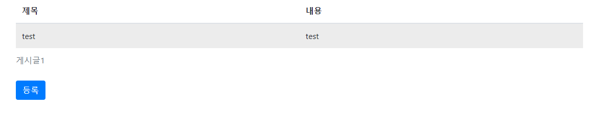
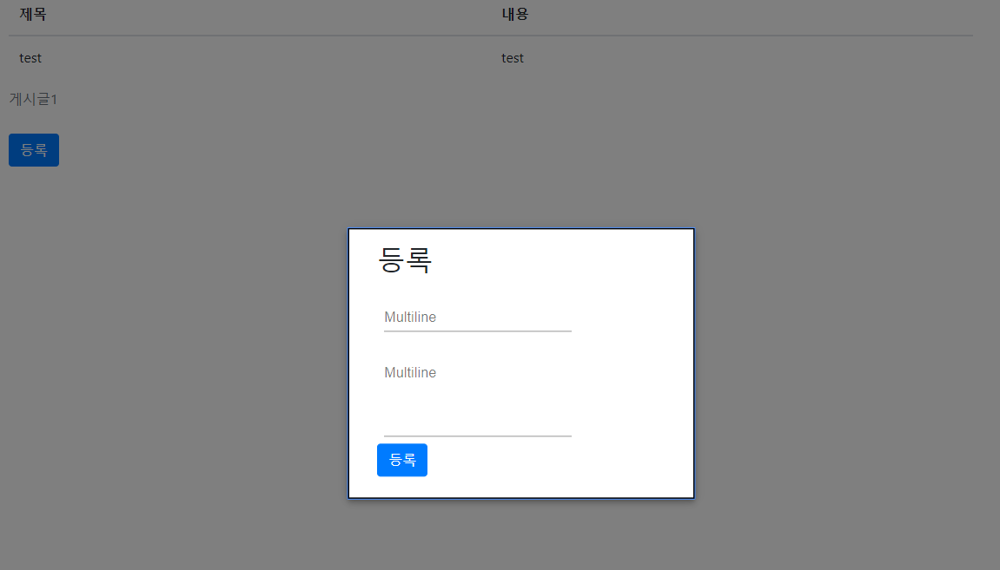
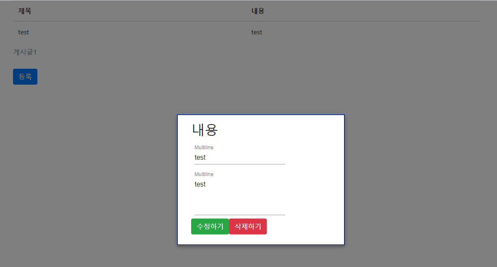

## DB사용하지 않고 React로 게시판 만들기(with Redux)
---

20.4.15 게시글 등록 구현(단순 등록 및 출력만 확인) 
20.4.21 게시글 수정 구현(게시글 가져오기 및 해당 게시글 수정) 
20.4.24 게시글 삭제 구현 및 간단한 스타일링 및 게시글 개수 표현

## 간단한 구현 이미지
---

메인페이지(첫 화면)

등록 Modal

수정 및 보기 Modal

## 결론 및 다짐
---

react와 redux를 배우고 난 뒤 복습 겸 간단하게 게시판을 만들었다. 
파일을 적당히 분리하고 또한 렌더링 측면에서 효율적으로 더 하고싶은데 공부가 부족했다. 
 
다시 한 번 복습을 더 해보고 조금 더 효율적으로 구현할 수 있게 하며 또한
redux thunk와 타입스크립트, DB, Node를 이용하여 로그인 및 게시판을 만들어 봐야겠다. 
가능하면 css도 직접 다 디자인해보고 싶다.